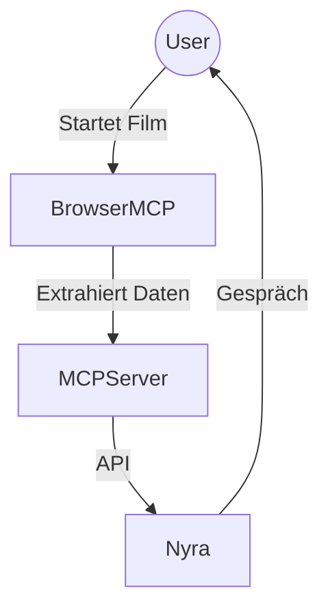

# Architektur

## Systemarchitektur

Das System besteht aus:
- MCP-Server (klassisch oder Browser MCP)
- Datenquellen: Video, Audio, Untertitel, Metadaten
- Nyra-Client (KI)

## Datenfluss
1. Daten werden extrahiert (Frames, Audio, Untertitel)
2. Über API an Nyra übertragen
3. Nyra analysiert, speichert Memories, bereitet Gesprächsmodus vor

## Alternative Basis: Browser MCP

**Vorteile:**
- Plattformunabhängig, kein direkter Dateizugriff nötig
- Kann Webplayer (Netflix, Prime, YouTube, Mediatheken, …) automatisiert steuern
- Screenshots, Untertitel, Playback-Status, DOM-Parsing möglich
- Erweiterbar durch Scripts/Plugins

**Beispiel-Workflow:**
1. Browser MCP steuert den Webplayer, liest Zeitstempel, holt Screenshots/Untertitel.
2. Überträgt Daten an den MCP-Server oder direkt an Nyra.
3. Nyra analysiert und speichert Memories, bereitet Gesprächsmodus vor.

**Diagramm-Vorschlag:**

## Erweiterungsmöglichkeiten
- Weitere Datenquellen (z.B. Streaming-APIs)
- Erweiterte Analyse-Module (Emotion, Szene, Zitate)
- Privacy-Optionen

## Querverweise
- [stack_and_libraries.md](stack_and_libraries.md#browser-mcp-als-basis)
- [api_blueprint.md](api_blueprint.md#browser-mcp-endpunkte)
- [nyra_integration.md](nyra_integration.md#browser-mcp-integration)
- [PROMPT.md](PROMPT.md)

## TODO
- Diagramm ausarbeiten
- Privacy-Flow ergänzen
