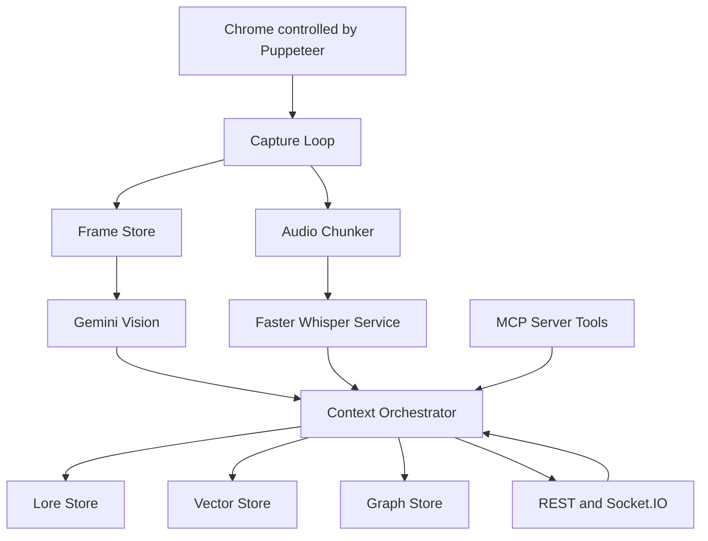

# Movie-MCP Prototype (TV-Watching AI) – Architecture Plan

This plan is written against the current repo state: MCP server + Express API server + Puppeteer-based capture are already present, but analysis/audio/memory are mostly mock.

Key existing entrypoints:
- [`MovieMCPServer`](src/mcp/server.ts:16) exposing tools like [`start_movie_session`](src/mcp/server.ts:132)
- [`APIServer`](src/api/server.ts:15) REST + Socket.IO session endpoints
- [`BrowserMCPIntegration`](src/browser/integration.ts:4) for navigation, cookie handling, screenshot capture, basic playback state
- Mock analysis scaffold in [`NyraIntegration.analyzeContent()`](src/nyra/integration.ts:18)

## 1) Target outcome and scope

### In-scope (initial milestone)
- Local desktop runtime, non-headless Chrome control.
- Sources: YouTube + generic HTML5 video sites first (no DRM-first work).
- Capture policy: fixed interval every 3s plus manual trigger.
- Canonical timebase: `HTMLVideoElement.currentTime`.
- Frames can be sent to Gemini Vision; transcripts and embeddings can be sent to OpenRouter.

### Out-of-scope (for now)
- DRM platforms (Netflix, Prime, Disney+) reliability.
- Scene-change detection (add later).
- Production hardening (auth, rate limiting) beyond basic safety and observability.

## 2) Proposed high-level architecture

### Component graph

### Design principles
- Separate capture, analysis, sync, and memory into explicit modules with clear contracts.
- Always persist raw artifacts locally (frames, audio chunks) before sending derived summaries outward.
- Treat time as first-class data (video time, wall time, and capture time all stored).
- Use fallbacks: if video element is not accessible, still capture page screenshot and mark limitations.

## 3) Timebase and synchronization design

### Canonical clock
- Use `video.currentTime` (seconds) as the ground truth.
- Every frame and audio chunk is tagged with a `videoTime` snapshot.

### Frame capture
- Frame event contains:
  - `frameVideoTimeSec`: read immediately before capture.
  - `capturedAtWallTime`: `Date.now()`.
  - `imageBase64`.

Existing code already does screenshot capture in [`BrowserMCPIntegration.captureFrame()`](src/browser/integration.ts:212), but currently it sets `timestamp: Date.now()` rather than video time. Plan is to evolve this to store both.

### Audio chunking and alignment
Audio is the tricky part, so the plan is to design the contract first, then implement capture adapters.

**Contract:**
- Record audio in fixed chunks (example: 10s) to keep Whisper latency bounded.
- Each chunk stores:
  - `chunkStartVideoTimeSec` and `chunkEndVideoTimeSec`
  - `chunkStartWallTimeMs` and `chunkEndWallTimeMs`
  - `durationSec`
  - `audioFormat` (wav pcm16 preferred for Whisper)

**Alignment method:**
- At the moment a chunk is finalized, sample `video.currentTime` to tag `chunkEndVideoTimeSec`.
- Compute `chunkStartVideoTimeSec = chunkEndVideoTimeSec - durationSec`.
- When Faster-Whisper returns segments relative to the chunk timeline, offset them by `chunkStartVideoTimeSec`.

**Why this works for Phase 2:**
- YouTube and many HTML5 players keep `currentTime` stable even under buffering.
- Small drift is acceptable initially; later we can add a periodic resync mapping.

## 4) Capture layer details

### 4.1 Browser control
Current behavior:
- [`BrowserMCPIntegration.initialize()`](src/browser/integration.ts:23) tries to connect to an existing Chrome at `http://localhost:9222` then falls back to launching.

Plan:
- Formalize a Chrome connection strategy:
  - Prefer connecting to an existing user Chrome with a known debugging port.
  - Else launch a dedicated profile directory to avoid user profile corruption.
- Add per-site adapter concept:
  - `YouTubeAdapter` for stable selectors and player behavior.
  - `GenericHtml5Adapter` for arbitrary sites.

### 4.2 Capture loop
- A scheduler that runs per active session:
  - Every 3 seconds: capture frame
  - On demand: manual capture
- Store all capture events in a local session store.
- Emit WebSocket events for live UI feedback (pattern already exists in [`APIServer`](src/api/server.ts:15)).

### 4.3 Playback state
Existing method: [`BrowserMCPIntegration.getPlaybackState()`](src/browser/integration.ts:329).

Plan:
- Extend playback state to expose:
  - player readiness
  - buffering state
  - whether we can access a video element vs fallback mode

## 5) Analysis layer

### 5.1 Gemini Vision (frames)
Add a dedicated module that:
- Accepts `FrameData` and returns a structured `VisionSceneDescriptor`.
- Prompting should request:
  - characters and actions
  - facial expressions and mood
  - setting, lighting, camera framing
  - notable symbols and text on screen
  - a short neutral description plus a more interpretive description

Integration point:
- Replace mock analysis in [`NyraIntegration.performContentAnalysis()`](src/nyra/integration.ts:47) with real calls, but keep a feature flag for mock mode.

### 5.2 Whisper (audio)
Add a local service boundary:
- Node side sends audio chunks to a local whisper worker.
- Worker returns:
  - transcript segments
  - timestamps per segment
  - optional language detection

Implementation flexibility:
- Start as a local HTTP service or stdio worker.
- Keep it container-friendly later, but initial dev should run locally.

## 6) Context Orchestrator (fusion and reasoning)

### Input
- Vision descriptor for a frame (or frame window).
- Whisper segments overlapping the same `videoTime` window.

### Output
A `SceneFusion` object:
- `sceneId`
- `timeRange` (start/end video time)
- `whatHappened` summary
- `characters` list with inferred state
- `tension` and `emotion` labels
- `loreCandidates` (symbols, recurring motifs, foreshadowing)
- `confidence`

### Reasoning
- Use OpenRouter with a strong model for higher-level narrative inference.
- Keep derived text only, not raw audio.
- Store prompts and model metadata for reproducibility.

## 7) Memory system (Neural Lore-Store)

### 7.1 Canonical store
Use SQLite as the canonical store for:
- sessions
- frames metadata
- audio chunks metadata
- whisper segments
- fused scenes
- extracted lore facts

### 7.2 Vector store
- Store embeddings for:
  - fused scene summaries
  - extracted symbols and lore candidates
  - character state deltas
- Retrieval powers `seek_to_event` and semantic queries.

### 7.3 Graph store
- Store entities and relationships:
  - Character
  - Location
  - Artifact/Symbol
  - Relationship edges with time validity

SQLite can host a simple graph model initially (edge list tables). If Neo4j is added later, keep an exporter.

## 8) MCP tool interface (the control surface)

Current MCP tool list is in [`MovieMCPServer.setupHandlers()`](src/mcp/server.ts:45).

Add or evolve tools (names from the vision statement):
- `watch_stream(url)`
  - Starts session and navigates
  - Returns sessionId
- `analyze_current_scene(sessionId, windowSec)`
  - Captures frame + grabs overlapping whisper segments
  - Runs fusion
  - Returns structured scene report
- `seek_to_event(sessionId, description)`
  - Embedding search in vector store
  - Performs browser seek to matched `videoTime`
- `generate_lore_summary(sessionId)`
  - Summarizes current plot state from fused scenes and facts

Expose parallel REST endpoints for local inspection and debugging (pattern already exists in [`APIServer.setupRoutes()`](src/api/server.ts:52)).

## 9) Data model sketch

Extend existing types in [`src/types/index.ts`](src/types/index.ts:1) with:
- `FrameData.videoTimeSec`
- `AudioChunk`
- `WhisperSegment`
- `VisionSceneDescriptor`
- `SceneFusion`
- `LoreFact`

Rule: store both `videoTimeSec` and wall-clock timestamps everywhere.

## 10) Risks and mitigations

- **Audio capture feasibility differs per site.**
  - Mitigation: pluggable audio capture adapters; allow Phase 1 to run vision-only.
- **YouTube DOM changes.**
  - Mitigation: isolate YouTube selectors in one adapter module.
- **Cross-origin iframe players.**
  - Mitigation: fallback to full-page screenshots; mark playback control as limited.
- **Cost and rate limits for Gemini/OpenRouter.**
  - Mitigation: caching, downsampling, and strict capture interval.

## 11) Testing strategy

- Unit tests for sync math (chunk alignment, offsets).
- Fixture replay: use stored frames + stored whisper JSON to test orchestrator deterministically.
- Integration tests for capture loop using a local HTML5 test page.

## 12) Incremental delivery roadmap

- Phase 1 Eye
  - Stabilize browser control, frame capture loop, and Gemini Vision analysis.
- Phase 2 Ears
  - Add audio chunking and faster-whisper service integration.
- Phase 3 Sync
  - Implement alignment and validate on YouTube content.
- Phase 4 Memory
  - SQLite canonical store + embeddings + retrieval.
- Phase 5 Soul
  - Final MCP tool surface, lore summaries, seek-to-event.
